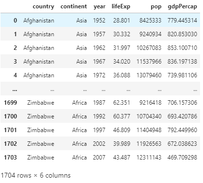

# Project 1

## 1. 
A package place which contains a ton of modules. A library is not too different from a package except that it contains a number of different packages. In order to use it you have to first install the package from the interpreter and then import it into your workspace. ```import numpy as np``` or ```import pandas as pd``` are examples we have used in class. By importing pandas as 'pd' ('pd' is the alias), the alias allows for cleaner, simpler, and shorter code. 

## 2. 
A data frame is like a chart with mulitple rows and columns of information that can be sifted through. The pandas library is useful for working with data frames. To read a file from its remote location you can use the ```.read()``` command. Example:
```
path_to_data = 'gapminder.tsv'
data = pd.read_csv(path_to_data, sep='\t')
``` 
This shows how to read a file and import it into the work session. Specificying an arguement within the ```read()``` function is significant because in the example about the data is a ```.tsv```, so it is tab separated, thus needing to add ```sep='\t')``` into the ```read_csv()```.

Example of data frame I created from the code snippet above:




The description of data can be seen by ```data.describe()``` or ```data.info()```. The number of rows and columns can be determined by ```data.shape```. Columns can also be seen by ```data.columns```

## 3. 
The ```year``` variable exhibits regular intervals of 5 years starting with 1952. Adding data from 2012 and 2017 would make it more current. 284 new outcomes would be added to the data frame; 142 for each year. 

## 4. 
The country Rwanda in Africa had the lowest life expectancy of 23.599 in the year of 1992. The reason for this is the Rwandan Genocide at the time where lots of people died as well as the poor living and health conditions overall. 

## 5. 
The last column shows the Total GDP for the countries in 2002:


The last column shows the Total GDP for the countries in 2007:


Spain exhibited the most significant increase in Total GDP during the previous 5-year period.

## 6. 
The ``` & ``` is the AND operator. It is useful in finding data that has multiple criteria for example ```data_asia = data[(data['continent']=='Asia') & (data['year'] == data['year'].max())]```. 

The ```==``` is the EQUAL TO operator. It compares two operands and returns ```TRUE``` if both operands are equal. Example in programming: ```data_asia = data[(data['continent']=='Asia')]```. This adds to the index wherever the continent is Asia is true. 

The ```|``` is the OR operator. It compares two operands and returns ```TRUE``` if either operand is true. Example in programming: ```ex_country = data[(data['country']=='Germany') | (data['country']=='France')]```. This adds to the index wherever the country is Germany or the country is France is true.

The ```^``` is the XOR operator and compares operands and returns ```TRUE``` if only one operand is true but returns ```FALSE``` is both are true or both are false. Example: ```('bob' == 'joe') ^ (21>20)``` will return ```TRUE```

## 7. 
The ```.loc``` gets information from its label, while ```.iloc``` gets information from its integer position. 

## 8. 
An API stands for Application Programming Interface. It is used to send and get data by code. Here is an example:
```
import requests

url = 'https://api.covidtracking.com/v1/states/daily.csv'

r = requests.get(url)
with open(file_name, 'wb') as f:
    f.write(r.content)

import pandas as pd
df = pd.read_csv(file_name)
```

## 9. 
The ```.apply()``` is a method for iterating over a loop. A function gets inputted and applied to the data frame. Using ```.apply()``` is an alternative to  ```.iterrows()```. ```.apply()``` is the preferred approach because []. 

## 10. 
An alterative approach to ```.iloc``` is to use ```.get_value()``` and ```.set_value()```. 
