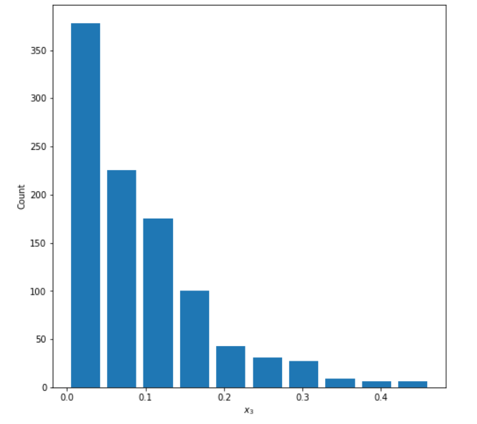
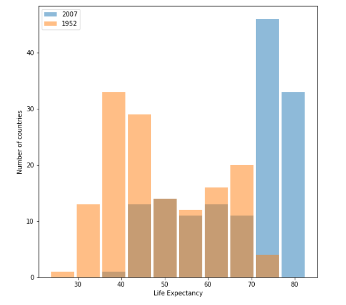
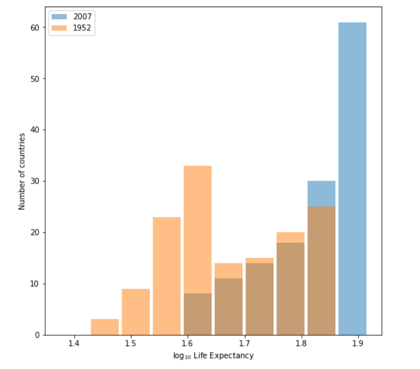
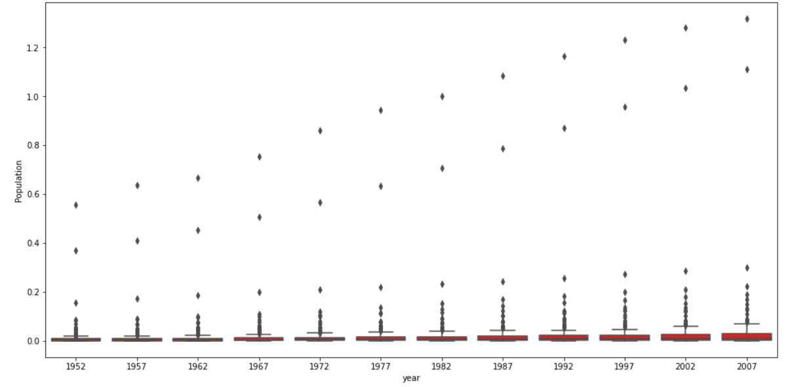
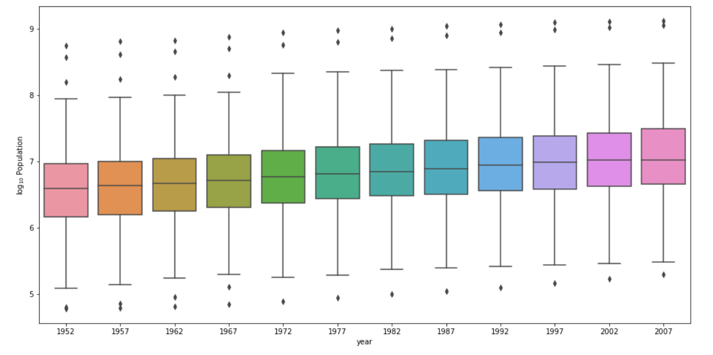

# Project 2

## 1. 
Continuous data is data that keeps changing or keeps updating. An example of continuous data would be a person's age or a person's height
Ordinal data is data where the order of values but not the difference. An example of ordinal data would be 1st, 2nd, and 3rd place in a race
Nominal data is data that is categorical. Examples of nominal data are countries, occupations, or genders

A model of my own construction is a randomly selected group of people which I would to run in a 5k race. Before the race I would ask for people's ages and their genders. Their ages would be the continuous data. Their genders would be the nominal data. Their placing at the end of completing the 5K would be the ordinal data.

## 2.
### Normal Distribution

Mean: 0.496

Median: 0.499

### Left Skewed Distribution

Mean: 0.909

Median: 0.933

### Right Skewed Distribution

Mean: 0.093

Median: 0.070

## 3.
### Raw Data

### Log Transformation Data

Of the two resulting plots, the log transformation data plot best communicates the changes in life expectancy amongst all of the countries from 1952 to 2007. We are able to clearly see the differences between the two years with the overlapping histogram produced with the log transformation. 

## 4.
### Raw Box & Whisker

### Log Transformation Box & Whisker

Of the two resulting plots, the log transformation box and whisker plot clearly best communicates the population for all countries at the given 5-year intervals. We are able to clearly see the boxplots and their values on the Log10 transformation plot and are unable to on the raw data plot. 
