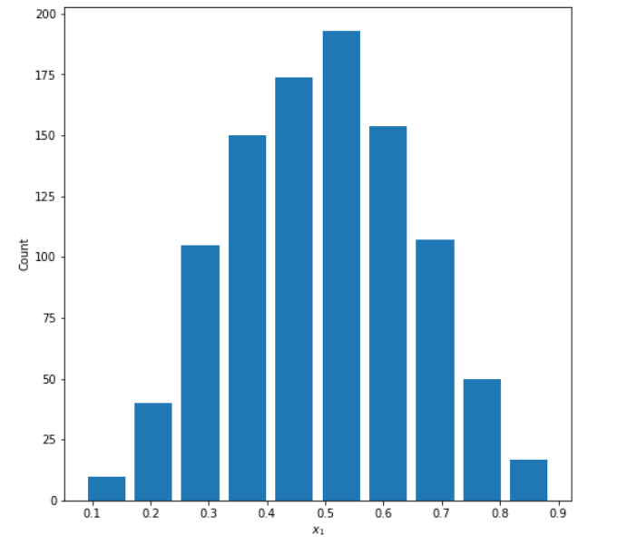
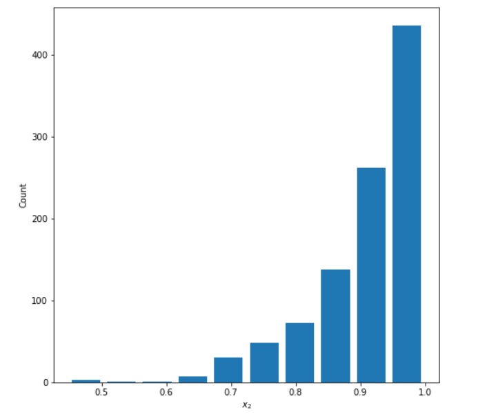

# Project 2

## 1. 
Continuous data is data that keeps changing or keeps updating. An example of continuous data would be a person's age or a person's height
Ordinal data is data where the order of values but not the difference. An example of ordinal data would be 1st, 2nd, and 3rd place in a race
Nominal data is data that is categorical. Examples of nominal data are countries, occupations, or genders

A model of my own construction is a randomly selected group of people which I would to run in a 5k race. Before the race I would ask for people's ages and their genders. Their ages would be the continuous data. Their genders would be the nominal data. Their placing at the end of completing the 5K would be the ordinal data.

## 2.
### Normally Distributed

Mean: 0.496

Median: 0.499

### Left Skewed

Mean: 0.909

Median: 0.933

### Right Skewed
