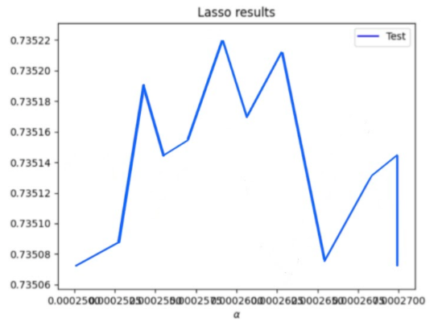
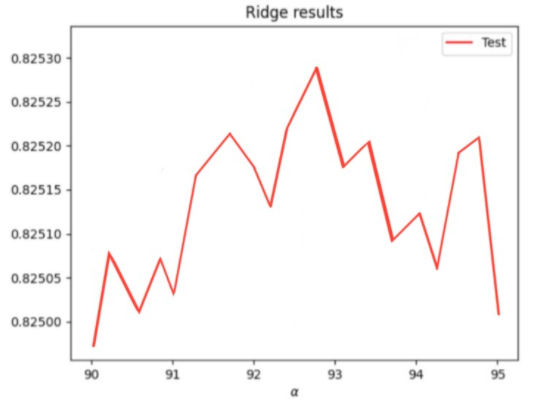

# Project 5 - Part 1

## 1. Data Set Up
In order to work in the data there were a few steps I had to do first. After bringing the dataset into my workspace, I removed all the NaNs and changed all the values to integers. These steps proved to be very helpful in order to get started on the regressions I needed to do. I was also able to see the types of each of the columns. 
```
pns = pd.read_csv('persons.csv')

check_nan = pns['age'].isnull().values.any()
pns.dropna(inplace=True)

pns['age'] = pns['age'].astype(int)
pns['edu'] = pns['edu'].astype(int)

display(pns.dtypes)
```

## 2. Data Results on WealthC
First, I set the variable **wealthC** as my target. 
```
X = pns.drop(["wealthC", "wealthI"], axis=1)
y = pns.wealthC
```
I performed a linear regression and computed the mean squared error, MSE. For the MSE, I got 0.44281. Then I standardized the features and again computed the MSE. With that step, I got the same MSE of 0.44296. They are practically the same. When comparing the coefficients of the two models, the standardized coefficients is different from and smaller than the non-standardized set.

For my linear regression, I got a training score of 0.73084 and testing score of 0.73006. I also got a mean MSE training score of 0.44279 and a mean MSE testing score of 0.44375. After standardizing the data, I got a training score of 0.73072 and testing score of 0.73002. Copared to the non-standardized set, these are slightly lower yet a very insignificant different. The standardized mean MSE training score was 0.44281 and the mean MSE testing score was 0.44369. Again, very close and different but still extremely insignificant. 

Next I ran a ridge regression on the dataset given. The results I got were an alpha value of 72.6514 with a training score of 0.73584 and a testing score of 0.73505. Overall, there was a strong correlation between the features and targets as the R squared value was so close to 1. The ridge regression also shows an improvement in correlation from the linear regression I previously performed. 

Then I ran a lasso regression. The results I got were an alpha value of 0.0002633 with a training score of 0.73583 and a testing score of 0.73506. Again, like the ridge regession, the lasso regression also shows a very strong correlation between the features and targets from the data. Though a very very slight improvement, the score is virtually the same as the ridge regression but I'd say the lasso regression performed the best for WealthC. 

## 3. Data Results on WealthI
The next step was doing all my previos steps on a different variable. I used the variable to **wealthI** as my target.
```
X = pns.drop(["wealthC", "wealthI"], axis=1)
y = pns.wealthI
```
I performed a linear regression and computed the mean squared error, MSE. For the MSE, I got 1750276834.9304798. Then I standardized the features and again computed the MSE. With that step, I got the same MSE of 1750287416.4378211. These are such large numbers which was a bit weird to get and do not know exactly what went wrong or what was going on. When comparing the coefficients of the two models, the standardized coefficients is different from and a lot bigger than the non-standardized set proving to have a bigger impact on the target values.

For my linear regression, I got a training score of 0.82584 and testing score of 0.82502. I also got a mean MSE training score of 1750165639.78992 and a mean MSE testing score of 1754642088.30058. After standardizing the data, I got a training score of 0.82582 and testing score of 0.82501. Copared to the non-standardized set, these are slightly lower yet again very insignificant different.

Next I ran a ridge regression on the dataset given. The results I got were an alpha value of 92.8941 with a training score of 0.82583689 and a testing score of 0.82502032. Overall, there was a very strong correlation between the features and targets as the R squared value was so close to 1. The ridge regression again shows an improvement in correlation from the linear regression I previously performed. 

Then I ran a lasso regression. The results I got were an alpha value of 1.02366 with a training score of 0.82588876 and a testing score of 0.82501657. Again, like the ridge regession, the lasso regression also shows a very strong correlation between the features and targets from the data. Though a very very slight improvement, the score is virtually the same as the ridge regression but I'd say the ridge regression performed the best for WealthI. 

## 4. Best Results from Data
Overall, I'd say that WealthI produced the best results in predicting wealth of all persons throughout the smaller West African contry than WealthC did. This conclusion can be seen by the consistantly higher R squared training and testing values between all the regressions: linear, ridge, and lasso. But between the models of the 2 different wealths, WealthC and WealthI, the models that produced the best results were different. The model that produced the best results for WealthC was the lasso regression and the model that produced the best results for WealthI was the ridge regression. This is evident in the higher training and testing scores when compared to the other two models in that were also performed. But still the results only differed between the models by a small number, a very slim margin. My plots show the alpha value with the mean R squared value. The Lasso results graph is for WealthC and the Ridge results graph is for WealthI. 



