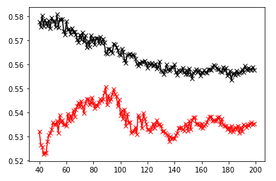
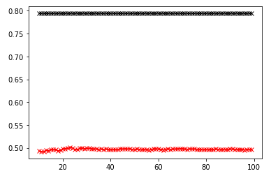

# Project 5 - Part 1

## 1. Data Set Up
In order to work with the data there were a few steps I had to do first. After bringing the dataset into my workspace, I removed all the NaNs and changed all the values to integers. These steps proved to be very helpful in order to get started on the stuff I needed to do. I was also able to see the types of each of the columns.
```
pns = pd.read_csv('city_persons.csv')
check_nan = pns['age'].isnull().values.any()
pns.dropna(inplace=True)

pns.reset_index(drop=True, inplace=True)

pns['age'] = pns['age'].astype(int)
pns['edu'] = pns['edu'].astype(int)

display(pns.dtypes)

X = pns.drop(["wealthC"],axis = 1)
y = pns.wealthC
```

## 2. K-Nearest Neighbors
When executing a KNN classification method, the best results produced from a range of 40 to 200 resulted in a testing score of 0.55051. When performing a KNN and adding a distance weight, the classification method produced a smalled testing score. It produced a score of 0.50024. 
 

## 3. Logistic Regression
Next, a logistic regression was executed. It resulted in a testing score of 0.55949. This higher testing score shows the logistic regressioned was better in comparison to the KNN that was previously produced. But it is only slightly better, not by a large number. 

## 4. Random Forest
Next, a random forest was performed to produce the best results. The number of estimators (or trees) to 100, 500, 1000, and 5000 with specifications is most likely to return the best model. The training and testing score for 100 trees was 0.7972005 and 0.4997559, respectively. The training and testing score for 500 trees was 0.7972005 and 0.4904831, respectively. The training and testing score for 1000 trees was 0.7972005 and 0.4982918, respectively. The training and testing score for 1000 trees was 0.7972005 and 0.4953636, respectively.

## 5. Recoding Wealth Class 2 & 3
With the previous steps done again, there was a difference from before with recoding the wealth classes 2 and 3 into a single outcome. I redid all of the previous models to see the results with the recoding. 

The KNN testing score for the recoding was 0.50093 . And when adding the distance weight, the testing score was 0.46015. The testing score for the recoding was overall was lower than before with wealth class 2 and 3 split. Also when adding the distance weight, the testing score was lower than without the distance weight. 

For the logistic regression, the testing score when executed was 0.51274. The logistic regression score decreased compared to the logistic regression from before. Compared to the KNN and KNN with distance it is higher than both of those for the recoded wealth 2 & 3 data. 

With the random forest: . 

## 6. Result Analysis
